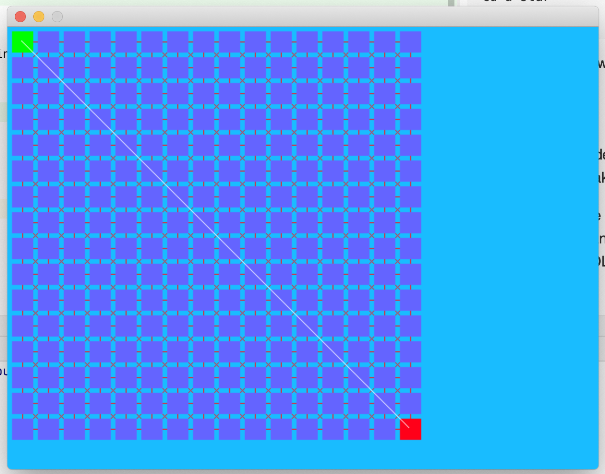
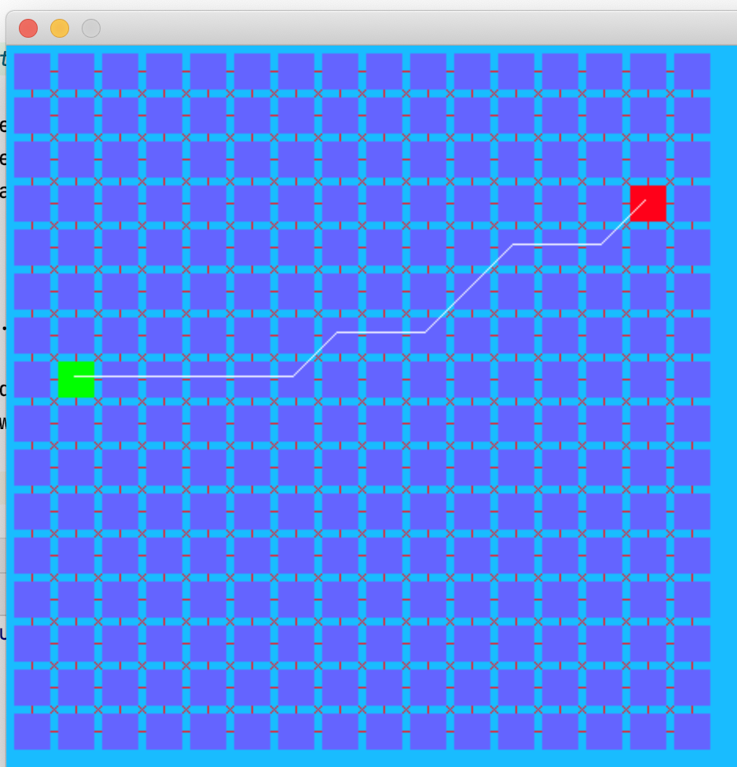
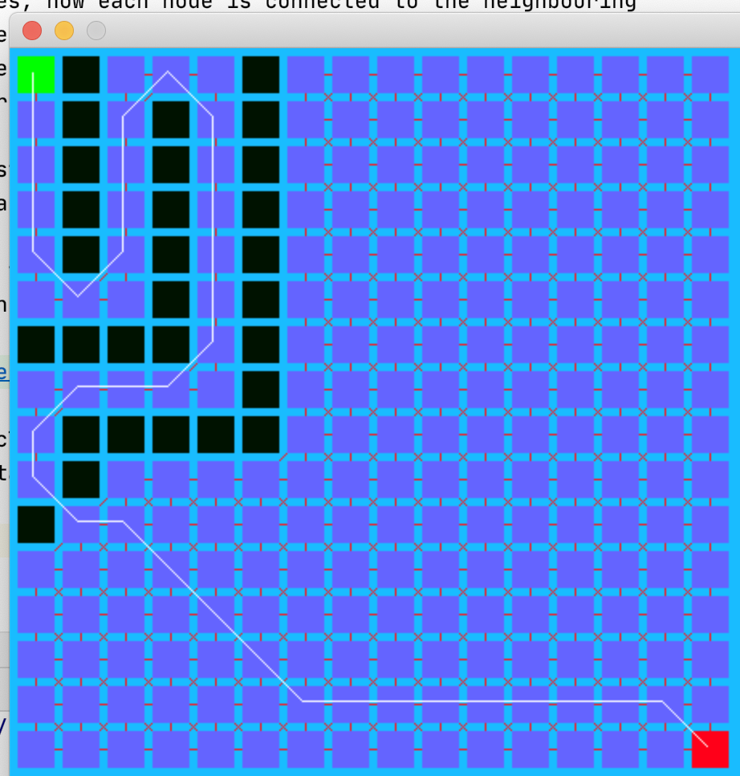
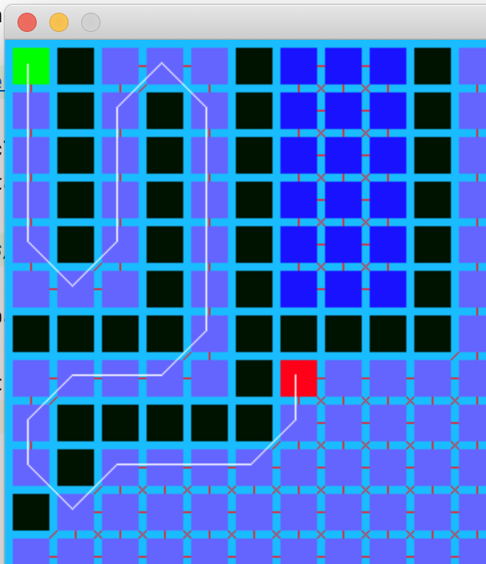
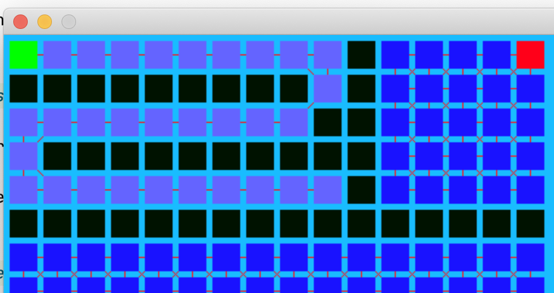

# The A-star Path Finding Algorithm
An implementation of the A-star path finding algorithm using SDL2 to visualize 
the path. Based on the A-star tutorial by OneLoneCoder.

## Getting Started

Use brew to install SDL2 (SDL2: stable 2.0.12)
From the SDL2AStar directory follow the following steps to build the project

```commandline
mkdir build
cd build
cmake ..
make
``` 
the application `a-star` will be in the `build/a-star` directory.

```commandline
cd a-star
./a-star
```

The following window will open:



This shows the grid of nodes, how each node is connected to the neighbouring 
nodes, the green start node, the red end node and the path from the start node 
to the end node. All of the nodes are a faded blue colour since they have all
been tested by the A* algorithm.

The position of the green starting node can be changed by holding the shift key 
and clicking on the new start node.

Similarly, the position of the ending node can be changed by holding the 
control key and clicking on the new end node.



Obstacles can be added by clicking on empty nodes, turning them black. The path
will need to go around obstacles.



Note the behaviour of the path with respect to diagonally placed obstacles.

Finally, nodes that are not reachable by the search algorithm are colored dark 
blue. 



It is possible for the A* to fail, in this case no path will be displayed.



 
### Next Steps

* It is possible to change the code to implement Dijkstra's search algorithm,
  I'll add a switch in the empty space of the window to do that.
* The default is to search all available nodes, even when the end node has been 
  found, it is possible to stop the search when we find the end node.
* The code is a bit messy, I need to do some refactoring to make it a bit 
  easier to follow.

### Prerequisites

The following applications were used to create and build this demo.
* macOS Catalina(Version 10.15.4) 
* CLion 2020.1.1, c++17, 
* cmake 3.17.2 
* GNU Make 3.81.

## Built With

* [JetBrains CLion](https://www.jetbrains.com/clion/) 
* [SDL2](https://www.libsdl.org/download-2.0.php) - Simple Direct Media Layer

## Contributing

I'd be very happy to hear your comments and suggestions for this project.


## Authors

* **Rich Nistuk** - *Initial work* - [rnistuk](https://github.com/rnistuk)


## Acknowledgments

* [javidx9 OneLoneCoder](https://www.youtube.com/channel/UC-yuWVUplUJZvieEligKBkA/about) - A great educational youTube 
  channel, javidx9 has many great coding tutorials and I based this project on his [Path Planning - A* (A-Star)](https://www.youtube.com/watch?v=icZj67PTFhc)
  tutorial video.   
  [OneLoneCoder community](https://community.onelonecoder.com)   
  [OneLonecoder Github](https://github.com/OneLoneCoder) 
* [A-star on Wikipedia](https://en.wikipedia.org/wiki/A*_search_algorithm)

